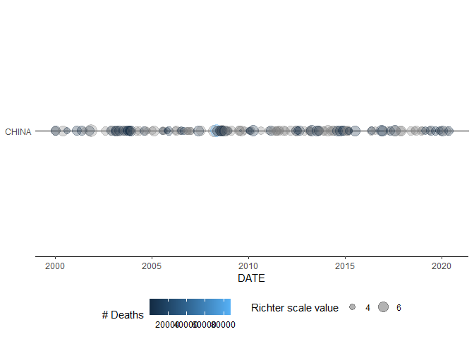
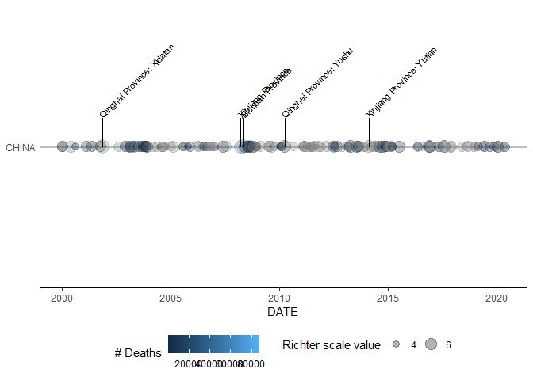
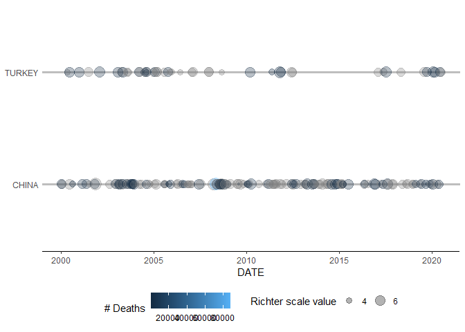
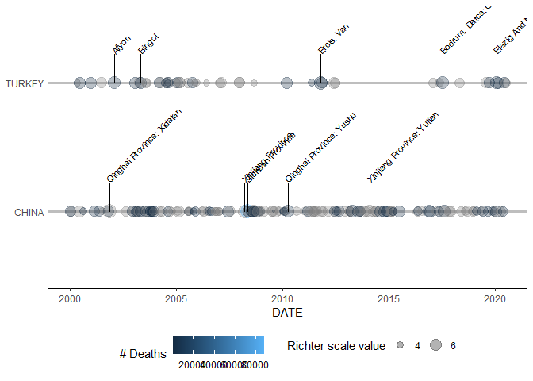

<!-- README.md is generated from README.Rmd. Please edit that file -->

# capstoner

<!-- badges: start -->

[](https://travis-ci.com/hugostar7/capstoner)
[](https://github.com/hugostar7/capstoner/actions/workflows/R-CMD-check.yaml)
<!-- badges: end -->

The goal of `capstoner` is to provide means to analyse earthquakes data.
Functions in this package can be used to create data visualization tools
such as time series plots and interactive maps of earthquakes data with
specific columns: `Year`, `Mo` for months, `Dy` for days,
`Location Name`, `Longitude`, `Latitude`. The functions
`eq_clean_data()` and `eq_location_clean()` can be used to clean the
data and create the columns: `DATE`, `COUNTRY`, `LOCATION_NAME`
`LONGITUDE`, `LATITUDE` in a format required for our data analysis. The
function `geom_timeline()` creates time series plots which can be
annotated with `geom_timeline_label()`. The function `eq_create_label()`
helps in customizing popups on interactive maps created using
`eq_map()`.

## Installation

You can install the development version of capstoner from
[GitHub](https://github.com/) with:

``` r
# install.packages("devtools")
devtools::install_github("hugostar7/capstoner")
```

## Example

This is a basic example which shows you how to clean your data using
`eq_clean_data` and `eq_location_clean`

``` r
library(capstoner)
library(magrittr)

data("earthquakes")

# Clean data and create DATE column
cd = eq_clean_data(earthquakes)
head(cd)[ , 33:36]
#> # A tibble: 6 × 4
#>   `Total Houses Damaged Description` DATE       LONGITUDE LATITUDE
#>                                <dbl> <date>         <dbl>    <dbl>
#> 1                                 NA 0037-04-09      36.1     36.1
#> 2                                 NA 0046-10-23     112.      33  
#> 3                                 NA 0079-08-24      14.4     40.8
#> 4                                 NA 0115-12-13      36.1     36.1
#> 5                                 NA 0128-02-23     105.      34.7
#> 6                                 NA 0138-03-01     104.      35.8

# Clean data and create proper COUNTRY and LOCATION_NAME columns
lcd = eq_location_clean(earthquakes)
head(lcd)[ , 33:37]
#> # A tibble: 6 × 5
#>   DATE       LONGITUDE LATITUDE COUNTRY LOCATION_NAME          
#>   <date>         <dbl>    <dbl> <chr>   <chr>                  
#> 1 0037-04-09      36.1     36.1 TURKEY  Antakya (Antioch)      
#> 2 0046-10-23     112.      33   CHINA   Henan Province: Nanyang
#> 3 0079-08-24      14.4     40.8 ITALY   Naples (Napoli)        
#> 4 0115-12-13      36.1     36.1 TURKEY  Antakya (Antioch)      
#> 5 0128-02-23     105.      34.7 CHINA   Gansu Province: Gangu  
#> 6 0138-03-01     104.      35.8 CHINA   Gansu Province
```

This is a basic example which shows you how to create a time serie plot
of earthquakes data

``` r
library(capstoner)
lcd = eq_location_clean(earthquakes, 2000, 2020, "CHINA")
p_china <- 
  ggplot2::ggplot(
    lcd, 
    ggplot2::aes(x = DATE, y = COUNTRY, size = Mag, colour = Deaths)) +
  geom_timeline() + theme_timeline() +
  ggplot2::scale_size_continuous(name = "Richter scale value",
                                 breaks = c(2, 4, 6, 8, 10)) +
  ggplot2::scale_color_continuous(name = "# Deaths")

p_china
```



Let’s annotate the previous plot using `geom_timeline_label`

``` r
p_china + 
  geom_timeline_label(
    lcd, ggplot2::aes(x = DATE, y = COUNTRY, label = LOCATION_NAME, orderBy = Mag), n_max = 5
  )
```



We can use the y aesthetic to create multiples time series plots of
earthquakes data

``` r
lcd = eq_location_clean(earthquakes, 2000, 2020, c("TURKEY", "CHINA"))
p_multi <- 
  ggplot2::ggplot(
    lcd, 
    ggplot2::aes(x = DATE, y = COUNTRY, size = Mag,
                 colour = Deaths)) +
  geom_timeline() + theme_timeline() +
  ggplot2::scale_size_continuous(name = "Richter scale value",
                                 breaks = c(2, 4, 6, 8, 10)) +
  ggplot2::scale_color_continuous(name = "# Deaths")

p_multi
```



We can also annotate multiples time series plots using
`geom_timeline_label`

``` r
p_multi + 
  geom_timeline_label(
    lcd, ggplot2::aes(x = DATE, y = COUNTRY,
                      label = LOCATION_NAME, orderBy = Mag), n_max = 5
  )
```



You can also create an interactive map for the earthquakes data:

``` r
earthquakes %>%
  eq_location_clean() %>% 
  dplyr::filter(COUNTRY == "MEXICO" & lubridate::year(DATE) >= 2000) %>% 
  eq_map(annot_col = "DATE")
```

<div class="leaflet html-widget html-fill-item-overflow-hidden html-fill-item" id="htmlwidget-32cc480216056552cadc" style="width:100%;height:480px;"></div>
<script type="application/json" data-for="htmlwidget-32cc480216056552cadc">{"x":{"options":{"crs":{"crsClass":"L.CRS.EPSG3857","code":null,"proj4def":null,"projectedBounds":null,"options":{}}},"calls":[{"method":"addTiles","args":["https://{s}.tile.openstreetmap.org/{z}/{x}/{y}.png",null,null,{"minZoom":0,"maxZoom":18,"tileSize":256,"subdomains":"abc","errorTileUrl":"","tms":false,"noWrap":false,"zoomOffset":0,"zoomReverse":false,"opacity":1,"zIndex":1,"detectRetina":false,"attribution":"&copy; <a href=\"https://openstreetmap.org\">OpenStreetMap<\/a> contributors, <a href=\"https://creativecommons.org/licenses/by-sa/2.0/\">CC-BY-SA<\/a>"}]},{"method":"addCircleMarkers","args":[[18.194,32.319,16.87,18.77,17.488,17.302,32.456,32.437,32.297,16.396,17.844,16.493,18.081,16.878,17.397,17.235,17.682,15.802,14.761,18.339,16.626,16.386,14.68,16.029,16.982,16.325,18.367,18.308],[-95.908,-115.322,-100.113,-104.104,-101.303,-100.198,-115.315,-115.165,-115.278,-97.782,-99.96299999999999,-98.23099999999999,-102.182,-99.498,-100.972,-100.746,-95.65300000000001,-93.633,-94.10299999999999,-98.68000000000001,-95.078,-97.979,-92.453,-95.901,-99.773,-95.85599999999999,-103.252,-102.923],[5.9,5.5,5.3,7.5,6.1,6,5.1,5.9,7.2,6.2,6.4,7.4,6,6.2,7.2,6.4,6.3,6.6,8.199999999999999,7.1,6.1,7.2,6.7,7.4,7,5.5,7.6,6.8],null,null,{"interactive":true,"className":"","stroke":true,"color":"#03F","weight":5,"opacity":0.5,"fill":true,"fillColor":"#03F","fillOpacity":0.4},null,null,["2002-01-30","2002-02-22","2002-09-25","2003-01-22","2004-01-01","2007-04-13","2008-02-09","2009-12-30","2010-04-04","2010-06-30","2011-12-11","2012-03-20","2013-04-22","2013-08-21","2014-04-18","2014-05-08","2014-07-29","2015-12-17","2017-09-08","2017-09-19","2017-09-23","2018-02-16","2019-02-01","2020-06-23","2021-09-08","2022-05-25","2022-09-19","2022-09-22"],null,["2002-01-30","2002-02-22","2002-09-25","2003-01-22","2004-01-01","2007-04-13","2008-02-09","2009-12-30","2010-04-04","2010-06-30","2011-12-11","2012-03-20","2013-04-22","2013-08-21","2014-04-18","2014-05-08","2014-07-29","2015-12-17","2017-09-08","2017-09-19","2017-09-23","2018-02-16","2019-02-01","2020-06-23","2021-09-08","2022-05-25","2022-09-19","2022-09-22"],{"interactive":false,"permanent":false,"direction":"auto","opacity":1,"offset":[0,0],"textsize":"10px","textOnly":false,"className":"","sticky":true},null]}],"limits":{"lat":[14.68,32.456],"lng":[-115.322,-92.453]}},"evals":[],"jsHooks":[]}</script>

``` r

# You can also use eq_location_clean to filter the data
eq_location_clean(earthquakes, year_min = 2000, countries = "MEXICO") %>%
  eq_map(annot_col = "DATE")
```

<div class="leaflet html-widget html-fill-item-overflow-hidden html-fill-item" id="htmlwidget-27b3384a7ea001c9cd56" style="width:100%;height:480px;"></div>
<script type="application/json" data-for="htmlwidget-27b3384a7ea001c9cd56">{"x":{"options":{"crs":{"crsClass":"L.CRS.EPSG3857","code":null,"proj4def":null,"projectedBounds":null,"options":{}}},"calls":[{"method":"addTiles","args":["https://{s}.tile.openstreetmap.org/{z}/{x}/{y}.png",null,null,{"minZoom":0,"maxZoom":18,"tileSize":256,"subdomains":"abc","errorTileUrl":"","tms":false,"noWrap":false,"zoomOffset":0,"zoomReverse":false,"opacity":1,"zIndex":1,"detectRetina":false,"attribution":"&copy; <a href=\"https://openstreetmap.org\">OpenStreetMap<\/a> contributors, <a href=\"https://creativecommons.org/licenses/by-sa/2.0/\">CC-BY-SA<\/a>"}]},{"method":"addCircleMarkers","args":[[18.194,32.319,16.87,18.77,17.488,17.302,32.456,32.437,32.297,16.396,17.844,16.493,18.081,16.878,17.397,17.235,17.682,15.802,14.761,18.339,16.626,16.386,14.68,16.029,16.982,16.325,18.367,18.308],[-95.908,-115.322,-100.113,-104.104,-101.303,-100.198,-115.315,-115.165,-115.278,-97.782,-99.96299999999999,-98.23099999999999,-102.182,-99.498,-100.972,-100.746,-95.65300000000001,-93.633,-94.10299999999999,-98.68000000000001,-95.078,-97.979,-92.453,-95.901,-99.773,-95.85599999999999,-103.252,-102.923],[5.9,5.5,5.3,7.5,6.1,6,5.1,5.9,7.2,6.2,6.4,7.4,6,6.2,7.2,6.4,6.3,6.6,8.199999999999999,7.1,6.1,7.2,6.7,7.4,7,5.5,7.6,6.8],null,null,{"interactive":true,"className":"","stroke":true,"color":"#03F","weight":5,"opacity":0.5,"fill":true,"fillColor":"#03F","fillOpacity":0.4},null,null,["2002-01-30","2002-02-22","2002-09-25","2003-01-22","2004-01-01","2007-04-13","2008-02-09","2009-12-30","2010-04-04","2010-06-30","2011-12-11","2012-03-20","2013-04-22","2013-08-21","2014-04-18","2014-05-08","2014-07-29","2015-12-17","2017-09-08","2017-09-19","2017-09-23","2018-02-16","2019-02-01","2020-06-23","2021-09-08","2022-05-25","2022-09-19","2022-09-22"],null,["2002-01-30","2002-02-22","2002-09-25","2003-01-22","2004-01-01","2007-04-13","2008-02-09","2009-12-30","2010-04-04","2010-06-30","2011-12-11","2012-03-20","2013-04-22","2013-08-21","2014-04-18","2014-05-08","2014-07-29","2015-12-17","2017-09-08","2017-09-19","2017-09-23","2018-02-16","2019-02-01","2020-06-23","2021-09-08","2022-05-25","2022-09-19","2022-09-22"],{"interactive":false,"permanent":false,"direction":"auto","opacity":1,"offset":[0,0],"textsize":"10px","textOnly":false,"className":"","sticky":true},null]}],"limits":{"lat":[14.68,32.456],"lng":[-115.322,-92.453]}},"evals":[],"jsHooks":[]}</script>

Let’s customize the popups on the previous map using `eq_create_label`

``` r
earthquakes %>%
  eq_location_clean() %>% 
  dplyr::filter(COUNTRY == "MEXICO" & lubridate::year(DATE) >= 2000) %>% 
  dplyr::mutate(popup_text = eq_create_label(.)) %>% 
  eq_map(annot_col = "popup_text")
```

<div class="leaflet html-widget html-fill-item-overflow-hidden html-fill-item" id="htmlwidget-cba3cb4ee775ead6069e" style="width:100%;height:480px;"></div>
<script type="application/json" data-for="htmlwidget-cba3cb4ee775ead6069e">{"x":{"options":{"crs":{"crsClass":"L.CRS.EPSG3857","code":null,"proj4def":null,"projectedBounds":null,"options":{}}},"calls":[{"method":"addTiles","args":["https://{s}.tile.openstreetmap.org/{z}/{x}/{y}.png",null,null,{"minZoom":0,"maxZoom":18,"tileSize":256,"subdomains":"abc","errorTileUrl":"","tms":false,"noWrap":false,"zoomOffset":0,"zoomReverse":false,"opacity":1,"zIndex":1,"detectRetina":false,"attribution":"&copy; <a href=\"https://openstreetmap.org\">OpenStreetMap<\/a> contributors, <a href=\"https://creativecommons.org/licenses/by-sa/2.0/\">CC-BY-SA<\/a>"}]},{"method":"addCircleMarkers","args":[[18.194,32.319,16.87,18.77,17.488,17.302,32.456,32.437,32.297,16.396,17.844,16.493,18.081,16.878,17.397,17.235,17.682,15.802,14.761,18.339,16.626,16.386,14.68,16.029,16.982,16.325,18.367,18.308],[-95.908,-115.322,-100.113,-104.104,-101.303,-100.198,-115.315,-115.165,-115.278,-97.782,-99.96299999999999,-98.23099999999999,-102.182,-99.498,-100.972,-100.746,-95.65300000000001,-93.633,-94.10299999999999,-98.68000000000001,-95.078,-97.979,-92.453,-95.901,-99.773,-95.85599999999999,-103.252,-102.923],[5.9,5.5,5.3,7.5,6.1,6,5.1,5.9,7.2,6.2,6.4,7.4,6,6.2,7.2,6.4,6.3,6.6,8.199999999999999,7.1,6.1,7.2,6.7,7.4,7,5.5,7.6,6.8],null,null,{"interactive":true,"className":"","stroke":true,"color":"#03F","weight":5,"opacity":0.5,"fill":true,"fillColor":"#03F","fillOpacity":0.4},null,null,[" <b> Location :<\/b> Veracruz: San Andres Tuxtla, Tuxtepec <br/> <b> Magnitude :<\/b> 5.9 <br/>"," <b> Location :<\/b> Mexicali, Baja California <br/> <b> Magnitude :<\/b> 5.5 <br/>"," <b> Location :<\/b> Acapulco <br/> <b> Magnitude :<\/b> 5.3 <br/>"," <b> Location :<\/b> Villa De Alvarez, Colima, Tecoman, Jalisco <br/> <b> Total Deaths :<\/b> 29 <br/> <b> Magnitude :<\/b> 7.5 <br/>"," <b> Location :<\/b> Guerrero, Mexico City <br/> <b> Magnitude :<\/b> 6.1 <br/>"," <b> Location :<\/b> Guerrero, Atoyac <br/> <b> Magnitude :<\/b> 6 <br/>"," <b> Location :<\/b> Baja California <br/> <b> Magnitude :<\/b> 5.1 <br/>"," <b> Location :<\/b> Mexicali <br/> <b> Magnitude :<\/b> 5.9 <br/>"," <b> Location :<\/b> Baja California <br/> <b> Total Deaths :<\/b> 2 <br/> <b> Magnitude :<\/b> 7.2 <br/>"," <b> Location :<\/b> San Andres Huaxpaltepec <br/> <b> Total Deaths :<\/b> 1 <br/> <b> Magnitude :<\/b> 6.2 <br/>"," <b> Location :<\/b> Guerrero <br/> <b> Total Deaths :<\/b> 2 <br/> <b> Magnitude :<\/b> 6.4 <br/>"," <b> Location :<\/b> Guerrero, Oaxaca <br/> <b> Total Deaths :<\/b> 2 <br/> <b> Magnitude :<\/b> 7.4 <br/>"," <b> Location :<\/b> Michoacan: Lazaro Cardenas <br/> <b> Magnitude :<\/b> 6 <br/>"," <b> Location :<\/b> San Marcos, Acapulco <br/> <b> Magnitude :<\/b> 6.2 <br/>"," <b> Location :<\/b> Guerrero; Mexico City <br/> <b> Magnitude :<\/b> 7.2 <br/>"," <b> Location :<\/b> Tecpan <br/> <b> Magnitude :<\/b> 6.4 <br/>"," <b> Location :<\/b> Oaxaca <br/> <b> Total Deaths :<\/b> 1 <br/> <b> Magnitude :<\/b> 6.3 <br/>"," <b> Location :<\/b> Cocotitlan <br/> <b> Total Deaths :<\/b> 2 <br/> <b> Magnitude :<\/b> 6.6 <br/>"," <b> Location :<\/b> Oaxaca, Chiapas, Tabasco; Guatemala <br/> <b> Total Deaths :<\/b> 98 <br/> <b> Magnitude :<\/b> 8.2 <br/>"," <b> Location :<\/b> Mexico City, Morelos, Puebla <br/> <b> Total Deaths :<\/b> 369 <br/> <b> Magnitude :<\/b> 7.1 <br/>"," <b> Location :<\/b> Oaxaca <br/> <b> Total Deaths :<\/b> 5 <br/> <b> Magnitude :<\/b> 6.1 <br/>"," <b> Location :<\/b> Oaxaca <br/> <b> Total Deaths :<\/b> 14 <br/> <b> Magnitude :<\/b> 7.2 <br/>"," <b> Location :<\/b> Chiapas; Guatemala: San Marcos <br/> <b> Magnitude :<\/b> 6.7 <br/>"," <b> Location :<\/b> Oaxaca <br/> <b> Total Deaths :<\/b> 10 <br/> <b> Magnitude :<\/b> 7.4 <br/>"," <b> Location :<\/b> Guerrero <br/> <b> Total Deaths :<\/b> 3 <br/> <b> Magnitude :<\/b> 7 <br/>"," <b> Location :<\/b> Oaxaca <br/> <b> Magnitude :<\/b> 5.5 <br/>"," <b> Location :<\/b> Michoacan, Colima, Jalisco <br/> <b> Total Deaths :<\/b> 2 <br/> <b> Magnitude :<\/b> 7.6 <br/>"," <b> Location :<\/b> Mexico City, Michoacan <br/> <b> Total Deaths :<\/b> 3 <br/> <b> Magnitude :<\/b> 6.8 <br/>"],null,[" <b> Location :<\/b> Veracruz: San Andres Tuxtla, Tuxtepec <br/> <b> Magnitude :<\/b> 5.9 <br/>"," <b> Location :<\/b> Mexicali, Baja California <br/> <b> Magnitude :<\/b> 5.5 <br/>"," <b> Location :<\/b> Acapulco <br/> <b> Magnitude :<\/b> 5.3 <br/>"," <b> Location :<\/b> Villa De Alvarez, Colima, Tecoman, Jalisco <br/> <b> Total Deaths :<\/b> 29 <br/> <b> Magnitude :<\/b> 7.5 <br/>"," <b> Location :<\/b> Guerrero, Mexico City <br/> <b> Magnitude :<\/b> 6.1 <br/>"," <b> Location :<\/b> Guerrero, Atoyac <br/> <b> Magnitude :<\/b> 6 <br/>"," <b> Location :<\/b> Baja California <br/> <b> Magnitude :<\/b> 5.1 <br/>"," <b> Location :<\/b> Mexicali <br/> <b> Magnitude :<\/b> 5.9 <br/>"," <b> Location :<\/b> Baja California <br/> <b> Total Deaths :<\/b> 2 <br/> <b> Magnitude :<\/b> 7.2 <br/>"," <b> Location :<\/b> San Andres Huaxpaltepec <br/> <b> Total Deaths :<\/b> 1 <br/> <b> Magnitude :<\/b> 6.2 <br/>"," <b> Location :<\/b> Guerrero <br/> <b> Total Deaths :<\/b> 2 <br/> <b> Magnitude :<\/b> 6.4 <br/>"," <b> Location :<\/b> Guerrero, Oaxaca <br/> <b> Total Deaths :<\/b> 2 <br/> <b> Magnitude :<\/b> 7.4 <br/>"," <b> Location :<\/b> Michoacan: Lazaro Cardenas <br/> <b> Magnitude :<\/b> 6 <br/>"," <b> Location :<\/b> San Marcos, Acapulco <br/> <b> Magnitude :<\/b> 6.2 <br/>"," <b> Location :<\/b> Guerrero; Mexico City <br/> <b> Magnitude :<\/b> 7.2 <br/>"," <b> Location :<\/b> Tecpan <br/> <b> Magnitude :<\/b> 6.4 <br/>"," <b> Location :<\/b> Oaxaca <br/> <b> Total Deaths :<\/b> 1 <br/> <b> Magnitude :<\/b> 6.3 <br/>"," <b> Location :<\/b> Cocotitlan <br/> <b> Total Deaths :<\/b> 2 <br/> <b> Magnitude :<\/b> 6.6 <br/>"," <b> Location :<\/b> Oaxaca, Chiapas, Tabasco; Guatemala <br/> <b> Total Deaths :<\/b> 98 <br/> <b> Magnitude :<\/b> 8.2 <br/>"," <b> Location :<\/b> Mexico City, Morelos, Puebla <br/> <b> Total Deaths :<\/b> 369 <br/> <b> Magnitude :<\/b> 7.1 <br/>"," <b> Location :<\/b> Oaxaca <br/> <b> Total Deaths :<\/b> 5 <br/> <b> Magnitude :<\/b> 6.1 <br/>"," <b> Location :<\/b> Oaxaca <br/> <b> Total Deaths :<\/b> 14 <br/> <b> Magnitude :<\/b> 7.2 <br/>"," <b> Location :<\/b> Chiapas; Guatemala: San Marcos <br/> <b> Magnitude :<\/b> 6.7 <br/>"," <b> Location :<\/b> Oaxaca <br/> <b> Total Deaths :<\/b> 10 <br/> <b> Magnitude :<\/b> 7.4 <br/>"," <b> Location :<\/b> Guerrero <br/> <b> Total Deaths :<\/b> 3 <br/> <b> Magnitude :<\/b> 7 <br/>"," <b> Location :<\/b> Oaxaca <br/> <b> Magnitude :<\/b> 5.5 <br/>"," <b> Location :<\/b> Michoacan, Colima, Jalisco <br/> <b> Total Deaths :<\/b> 2 <br/> <b> Magnitude :<\/b> 7.6 <br/>"," <b> Location :<\/b> Mexico City, Michoacan <br/> <b> Total Deaths :<\/b> 3 <br/> <b> Magnitude :<\/b> 6.8 <br/>"],{"interactive":false,"permanent":false,"direction":"auto","opacity":1,"offset":[0,0],"textsize":"10px","textOnly":false,"className":"","sticky":true},null]}],"limits":{"lat":[14.68,32.456],"lng":[-115.322,-92.453]}},"evals":[],"jsHooks":[]}</script>
